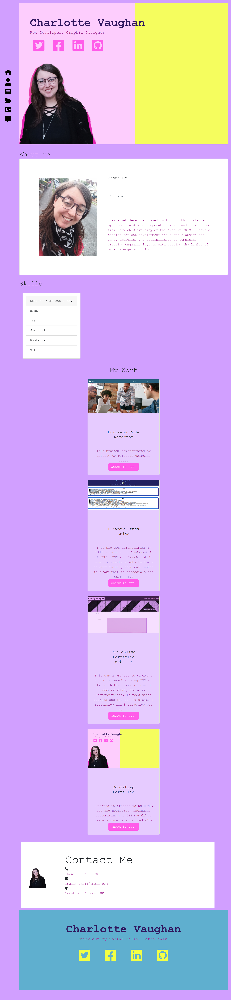

# Bootstrap-Portfolio

## Portfolio website made using Bootstrap as well as HTML and CSS

## Description

This project was created with the intention to be an online portfolio of my own Web Development work. My motivation was that if I need to showcase my work to potential employers or clients, I would need an easy and accessible way to do this. By showcasing my work in this digital format, not only is it a quick and easy way to share my work with anyone around the world while also allowing interactivity, but it also allowed me to show my skills with HTML, CSS and Bootstrap. I learnt a lot about using bootstrap and how to customize the CSS after using the premade templates that are within Bootstrap. I also learnt how to use icons and I strengthened my understanding of working with flex layouts and creating functional links to both external sources and to other parts of the same site.

## Screenshot

## Usage

The portfolio can be accessed from any device on any browser and you can visit different sections of the site using the navigation bar on the left hand side of the screen. Following the links in the "work" section will take you to the relevant deployed websites. If you wish to access the website, in order to view my work, please use the following link:

### Link to Site:

https://psychicsalad.github.io/Bootstrap-Portfolio/

Alternatively, to view the repository on GitHub, please see the link below, or alternatively access it via my GitHub profile and also view my other repositories at PsychicSalad.

### Link to GitHub Repository:

https://github.com/PsychicSalad/Bootstrap-Portfolio

## License

This project uses an MIT license.
